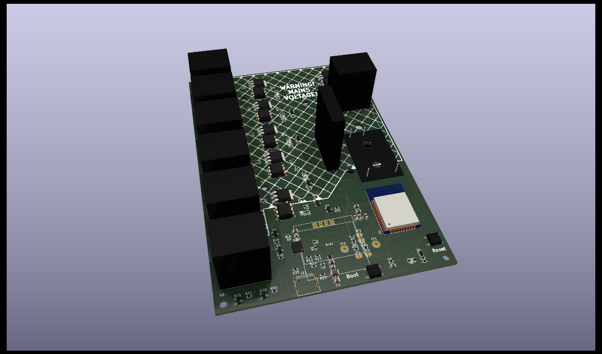

# heating-controller-esp32-hardware

This is a multi-zone heating controller, based on an ESP-32.

It uses Triacs for switching the boiler, pump and thermostats.

Right now, it is set up for 3 zones plus Domestic Hot Water.

It's designed to be used with this firmware:

https://github.com/aberridg/heating-controller-esp32-mqtt

The design can be used with physical thermostats or with triggering
via MQTT (for use with home automation systems such as Home Assistant).

[Schematic](/heating-controller-esp32.pdf)

I'm having some PCBs made/assembled by JLCPCB, so if you want one, let me know (via LinkedIn - link in my bio)! Or if you can't do that, raise an issue.

